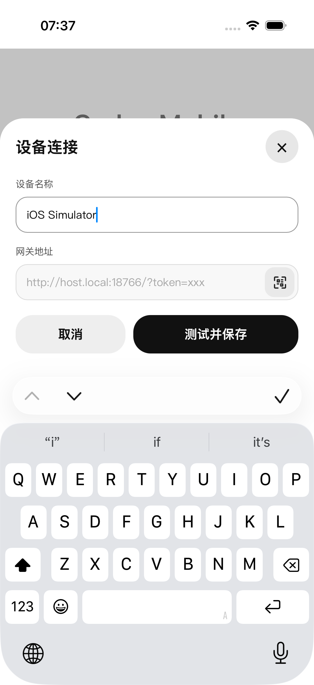
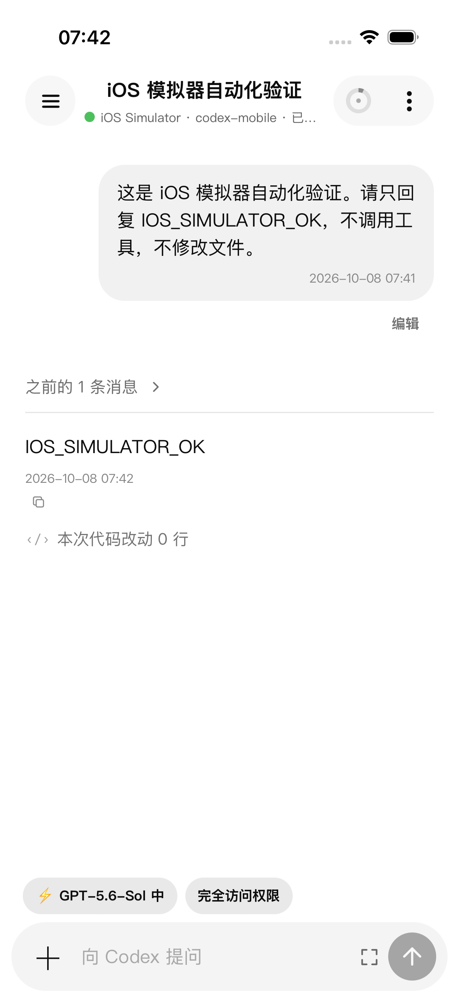
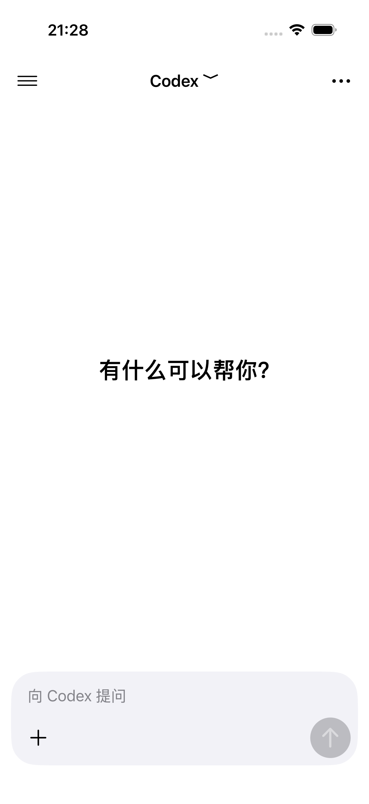
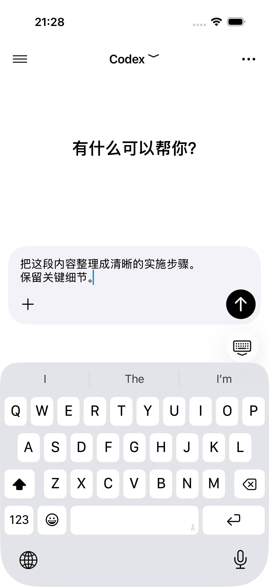
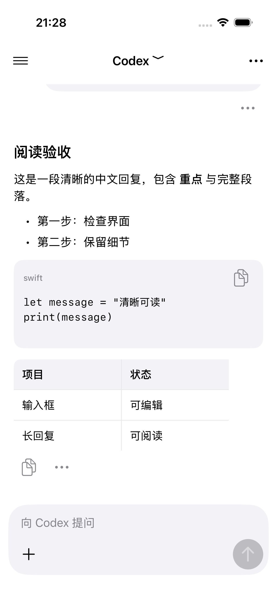
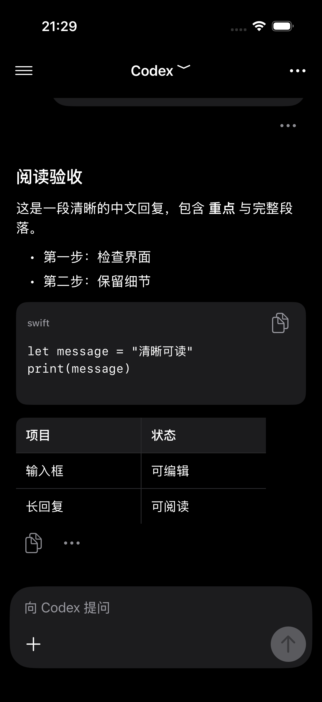

# iOS 本地构建与模拟器验证

Codex Mobile iOS 使用固定提交的 PakePlus SwiftUI / WKWebView 容器，对话列表与输入区由 UIKit 原生界面承载。React 继续管理连接、会话、草稿和写操作，原生通过带上下文与序列号的快照和事件交互；侧栏、设置与复杂内容保留网页入口。设备地址和口令由用户在 App 中添加，构建产物不携带私人网关配置。

## 生成与运行

要求 macOS、Xcode、Node.js 20.9+、Git、jq。首次运行先执行 `npm ci`。

```bash
npm run ios:prepare -- --version 0.2.91
open .mobile-build/ios/pakeplus/PakePlus.xcodeproj
```

在 Xcode 中选择 `PakePlus` scheme 和 iPhone 模拟器，再运行。也可通过 XcodeBuildMCP 设置上述工程、scheme 和模拟器后调用 `build_run_sim`。

```bash
xcodebuild \
  -project .mobile-build/ios/pakeplus/PakePlus.xcodeproj \
  -scheme PakePlus \
  -configuration Debug \
  -destination 'platform=iOS Simulator,name=iPhone 17 Pro,OS=26.5' \
  -derivedDataPath .mobile-build/ios-derived-data build
```

`--plan` 只输出步骤。准备脚本复用 `.github/workflows/build-ios.yml` 中的固定容器提交、pnpm 主版本、前端构建、配置和原生硬化；图标按 asset catalog 的尺寸在本地生成。成功后替换 `.mobile-build/ios/` 中的生成工程；不要在该目录维护手写源码。失败时保留上一次成功工程。

## 模拟器 UI 回归

UI 测试使用真实网关和 Codex app-server，会创建一条仅要求回复标识符的测试会话。使用新的测试模拟器可以完整覆盖首次配置；已配置模拟器会复用现有设备，继续验证重启和消息往返。测试环境需要中文界面。

启动测试网关（确保 `codex` 在 PATH 中）：

```bash
HOST=127.0.0.1 PORT=18786 CODEX_APP_SERVER_PORT=18785 \
CODEX_MOBILE_TOKEN=ios-simulator-check \
CODEX_MOBILE_RUNTIME_FILE=/tmp/codex-mobile-ios-runtime.json \
CODEX_MOBILE_SERVE_STATIC=false npm start
```

这个口令仅用于本机临时测试。测试结束后关闭该终端网关。

原生回归还需要一条有更早分页消息的真实长会话。将其标题设置为测试 scheme 的
`NATIVE_IOS_SCROLL_THREAD_TITLE` 环境变量（或写入生成 `.xctestrun` 中该 target 的 `EnvironmentVariables`）。
历史测试只读取这条会话，不发送请求；发送测试另建会话，结束后必须归档。

安装生成测试 target 的 Ruby 依赖，然后添加测试 scheme：

```bash
gem install xcodeproj --user-install
ruby scripts/configure-ios-tests.rb
xcodebuild \
  -project .mobile-build/ios/pakeplus/PakePlus.xcodeproj \
  -scheme CodexMobileUITests \
  -destination 'platform=iOS Simulator,name=iPhone 17 Pro,OS=26.5' \
  -derivedDataPath .mobile-build/ios-derived-data \
  -parallel-testing-enabled NO \
  -resultBundlePath .mobile-build/ios-ui-tests.xcresult test
```

每次 `resultBundlePath` 应为空目录或使用新名称。XcodeBuildMCP 的 `test_sim` 同样可执行此 scheme。

当前原生核心回归使用 `-only-testing:CodexMobileUITests/NativeConversationUITests`。
历史 Web 键盘用例保留作完整页面的诊断，不能直接作为原生输入框的验收。

纯状态回归可在 macOS 无模拟器运行：

```bash
swiftc -D NATIVE_CONVERSATION_STATE_TESTS \
  mobile/ios/NativeConversationState.swift mobile/ios/NativeConversationStateTests.swift \
  -o /tmp/codex-mobile-native-state-tests
/tmp/codex-mobile-native-state-tests
```

Node.js 26 自带 WebStorage 会影响 JSDOM 的 `localStorage`；本机 Vitest 使用
`NODE_OPTIONS=--no-experimental-webstorage npm test`，不修改产品存储行为。

## 2026-10-08 验证结果

版本 `0.2.91`，原生 build `2091`；iPhone 17 Pro，iOS 26.5，Xcode 27。

| 检查 | 结果 |
| --- | --- |
| 从当前源码生成内置前端和 Xcode 工程 | 通过 |
| 模拟器构建、安装、冷启动 | 通过 |
| 首次设备名称与网关地址输入 | 通过 |
| 错误口令提示与重新配置 | 通过，显示“访问口令不正确” |
| 真实网关初始化与会话列表 | 通过 |
| App 退出重启后设备配置保留 | 通过 |
| 新建会话、打开模型设置、选择“中”推理强度 | 通过 |
| 键盘弹出后输入框和发送按钮可操作 | 通过 |
| 真实消息发送、轮询与最终回复 | 通过，收到 `IOS_SIMULATOR_OK` |
| 未签名真机 Release 构建及 IPA 资源扫描 | 通过 |
| TypeScript 与相关打包、运行环境、viewport 回归 | 通过，21 项 |

XCTest 的完整流程为 1 项集成测试；首次配置验证和最终完整流程分别保留在本机 `.mobile-build/ios-ui-tests-6.xcresult` 与 `.mobile-build/ios-ui-tests-final.xcresult`。





修复了两处原生适配：WebView 只忽略容器安全区，保留键盘避让；Xcode 的 `MARKETING_VERSION` 与 `CURRENT_PROJECT_VERSION` 使用本次发布版本，避免 App 始终显示模板的 `1.0`。

模拟器验证不包含真机摄像头、麦克风、定位及后台推送。未签名 IPA 需要 Apple 签名后才能安装到真机；模拟器使用构建目录中的 `.app`。

## 2026-10-09 未发送草稿与键盘收起回归

新增 `testUnsentDraftRemainsStableAfterKeyboardDismissal`：已配置测试网关后打开新对话，输入草稿，点击系统键盘“Done / 完成”，验证键盘消失、输入框回到底部、12 次位置采样稳定、草稿完整保留，再次输入且发送按钮可操作。该用例不发送消息。

固定 iPhone 17 Pro / iOS 26.5 验证通过。修复在 `keyboardWillHideNotification` 同步取消网页编辑焦点，防止 WKWebView 在键盘收起和视口恢复时继续追踪输入光标。原生临时采样确认失焦后 `scrollY` 和 `visualViewport.offsetTop` 均为 0，DOM 焦点回到 `BODY`。辅助功能的 `Focused` 标记与 DOM 焦点不同，不用作网页焦点的断言。

```bash
xcodebuild -project .mobile-build/ios/pakeplus/PakePlus.xcodeproj \
  -scheme CodexMobileUITests \
  -destination 'platform=iOS Simulator,name=iPhone 17 Pro,OS=26.5' \
  -only-testing:CodexMobileUITests/CodexMobileUITests/testUnsentDraftRemainsStableAfterKeyboardDismissal \
  -parallel-testing-enabled NO test
```

### 点击对号时的动画期补充验证

用户继续复现后，确认前一轮的 DOM 失焦和动画结束后位置采样未覆盖原生图层动画。旧实现的真实绘制帧中，WKWebView 的布局高度与呈现层高度最大相差 `371.94px`，网页已经按恢复后的视口重排，固定输入栏却被仍在插值的原生图层裁剪。

正式容器改用 `CodexMobileWebView`，在 `super.layoutSubviews()` 后移除主图层的 `position`、`bounds` 及其子属性动画。键盘避让和失焦逻辑继续生效，网页子图层动画不受此处理影响。

`configure-ios-tests.rb` 额外安装 `KeyboardLayoutProbeWebView`，用 CADisplayLink 在键盘收起期间逐帧记录高度差。该探针仅出现在显式配置过 UI 测试的工程；普通 `ios:prepare` 和 IPA 发布工程不包含探针。重复配置测试工程已验证幂等。

iPhone 17 Pro / iOS 26.5 的 XCTest 和录屏检查结果：

| 草稿场景 | 动画期最大高度差 | 保留内容、位置稳定及再次编辑 |
| --- | --- | --- |
| 32 字符短文本 | 0px | 通过 |
| 36 字符三行中文 | 0px | 通过 |
| 160 字符长中文草稿 | 0px | 通过 |

三个场景均点击系统键盘对号 `Done / 完成`，并在收起后重复检查输入框位置与草稿，随后重新输入。重新编辑允许光标位于原文中间，移除新增文本后必须完整还原原草稿。单项集成测试通过，保留 `.mobile-build/keyboard-checkmark-verified.xcresult`、`.log` 和 `.mp4`。相关 Vitest 最终运行 52 项及 TypeScript 检查通过。

### 点击发送并收起键盘的补充修复

用户补充点击发送后收起键盘仍偶尔闪烁。旧容器在 `layoutSubviews` 中移除动画，但 UIKit 可以在布局之后继续追加动画；真实点击发送的 CADisplayLink 采样记录到主图层仍有 4 个 position / bounds 动画，新增的零几何动画断言失败。

正式实现改用 `CodexMobileWebViewLayer`，在 `CALayer.add` 入口直接拒绝主图层 position / bounds 动画，其他动画正常交给 `super.add`。网页子图层不使用这个图层类型，因此网页动画保持原有行为。发送表单在调用提交回调、清空草稿或还原最大化状态之前同步取消 textarea 焦点；普通和最大化输入的行为回归先失败、修复后通过。

新增 `testSendingDismissesKeyboardWithoutFlicker`，在 iPhone 17 Pro / iOS 26.5 分别发送短消息、长中文和最大化长中文，只请求回复固定标识。三个场景均验证真实回复、键盘消失、逐帧主图层几何动画数为 0、收起后 12 次位置采样变化不超过 1px，以及下一条输入可编辑；录屏检查通过。相关 Vitest 33 项和 TypeScript 检查通过。

高度探针继续保留为诊断，但不再把原始 model / presentation 高度差单独作为闪烁断言：Core Animation 提交前，新布局和上一呈现帧可以短暂不同。回归使用实际帧采样计数、整个收起期间零几何动画、稳态位置和输入行为作为通过条件。空 textarea 的 WKWebView 辅助功能值可能等于 placeholder；最大化按钮未被暴露为 AXButton 时，测试按相邻输入框定位并验证高度确实展开。

原生结果保留在 `.mobile-build/send-keyboard-verified.xcresult`（发送三场景通过）和 `.mobile-build/send-keyboard-done-verified.xcresult`（对号保留草稿回归）。测试探针仍仅由显式 UI 测试配置安装，不进入正式 IPA。

## 2026-10-09 核心对话原生化验证

iPhone 17 Pro / iOS 26.5，Xcode 27，测试构建 `0.2.130`。消息列表使用可复用 UITableView 行，输入使用 UITextView 与 keyboardLayoutGuide；稳定消息 ID 和首行偏移用于保持阅读位置。UIKit 视图位于独立容器内，与 WKWebView 为兄弟视图；显示原生时关闭底层网页的辅助功能暴露，隐藏后恢复。

四项 XCTest 全部通过：

- 中文多行草稿、Done 收键盘、再次编辑、返回侧栏再恢复草稿；原生输入与返回按钮均可实际点击。
- 原生发送经现有 React 逻辑和真实网关完成，收到 `NATIVE_IOS_OK`，草稿由业务层清空。
- 阅读长会话时状态更新保留行 ID 与屏幕偏移；“跳到最新”回到底部。
- 加载更早消息后原有可见行和偏移保持，误差不超过 3pt。

结果保留在主工作区 `.mobile-build/ios-native-release/native-host-verified.xcresult`。
全量 Vitest 823 项、Python iOS 回归 87 项、TypeScript、前端构建和 Foundation 原生状态回归通过；独立规格与代码质量审查通过。
多设备前后台切换、后台弹框过滤、Skill 光标回写、旧序列拒绝、中文 marked text、只读模式和中英文菜单亦有自动回归。

模拟器结果不等同于真机覆盖安装、数据保留或真机中文输入法组词已验证。


## 2026-10-09 对话可读性重做

本轮参考 [ChatGPT 官方 App Store 截图](https://apps.apple.com/us/app/chatgpt/id6448311069)，先捕获旧界面再实现与检查原生画面。原始失效回归确认空输入框只有 16pt 宽；新版输入区设置明确左右约束，空态宽度回归通过，发送按钮为 44×44pt。

当前界面采用一行顶栏、右侧用户气泡、左侧分块回复和底部圆角输入区。模型、权限、项目与设备入口移至菜单，工具与过程说明折叠为活动详情。Markdown 标题、段落、列表、引用、代码与横向表格分别排版；代码可复制，文字与表格可选择，列表保留起始编号。排队消息用单行入口与子菜单，避免挤满阅读区域。

已逐张检查实际截图，而不是用单元测试代替视觉验收：

| 空白对话 | 键盘展开 |
| --- | --- |
|  |  |

| 浅色回复 | 深色回复 |
| --- | --- |
|  |  |

验证环境：iPhone 17 Pro / iOS 26.5；9 个独立原生 UI 用例分别验证空输入框几何、页面截图、真实 Markdown 回复、回复截图、活动详情、草稿收起与恢复、真实发送、历史阅读锚点、分页锚点；相关用例额外重跑浅色和深色截图。35 个原始 Markdown 用例及编号修复新增 2 个用例，共 37 项 Foundation 回归通过，原有状态回归通过。全量 Vitest 824 项/92 文件，Python iOS 87 项，TypeScript 和前端构建通过；最后修改相关 Vitest 25 项重新通过。独立代码与视觉复审发现并修复附件高度冲突、空白正文崩溃、表格链接入口、有序编号与多队列高度问题。

本机原始截图与 xcresult 归档在 `.mobile-build/chat-redesign-audit/`；计划见 [重做计划](superpowers/plans/2026-10-09-ios-chat-redesign.md)。模拟器截图、构建与验签不代表已验证真机覆盖安装及数据保留。


回复截图用例的 `NATIVE_IOS_DESIGN_THREAD_TITLE` 指向本轮真实发送产生的 Markdown 测试会话，只用于显式视觉采样；未配置时跳过此截图用例，真实 Markdown 功能测试仍独立创建会话并验收。截图完成后归档测试会话，不把历史测试夹具留在用户列表中。

本次交付 `0.2.131`，客户端源码提交 `ce14c22`，已推送 `main`。固定渠道 JSON、HEAD 和完整 GET 均核对通过；HTTPS OTA 用本机 CA 校验清单、IPA 和安装页。

| 产物 | 版本 | 大小（字节） | SHA-256 |
| --- | --- | --- | --- |
| APK | 0.2.131 | 4,708,319 | `dc6c46352d186da716c6c4355a8f1231257a2a2646c83550b86823bb8a351461` |
| IPA（Ad Hoc 已签名） | 0.2.131 | 3,898,985 | `59d76e30dc5d4b3aaf1bcab9fe71973b79a00aa7ee3e3ebecca87e19265f2389` |

安装入口：[固定 OTA 安装页](https://192.168.123.79:8766/channels/codex-mobile/current/install.html)、[固定 IPA](http://192.168.123.79:8765/channels/codex-mobile/latest.ipa)、[固定 APK](http://192.168.123.79:8765/channels/codex-mobile/latest.apk)。本轮两条测试会话已归档，临时网关已停止，模拟器恢复浅色并释放占用。
